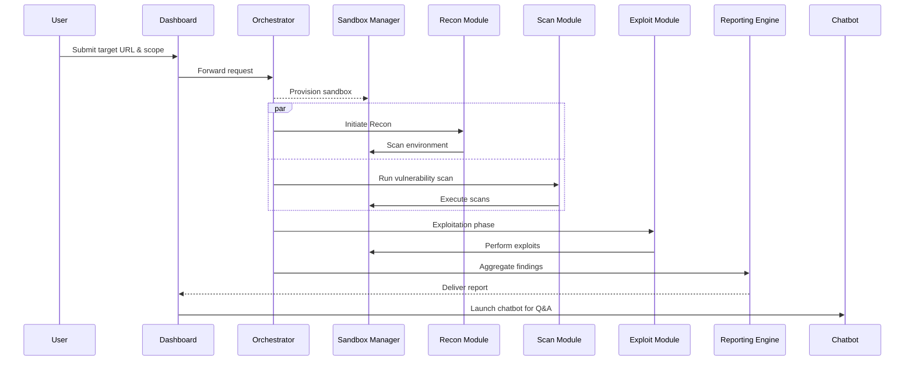
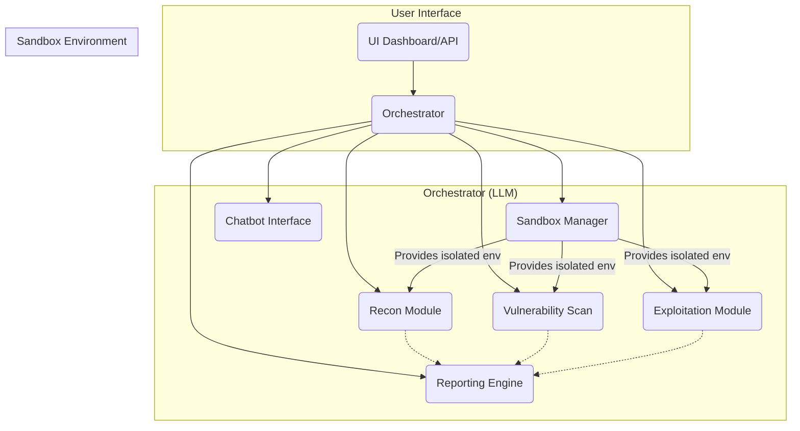

## 1. Executive Summary

**Product name (suggestion):** *AutoPen* – an AI‑orchestrated penetration‑testing platform that automatically builds isolated sandboxes, runs a full test suite, and hands you a human‑readable report plus an interactive chat interface to dig deeper into the findings.

**Value proposition:**  
- **Speed & Scale:** Turn a 10‑hour manual pentest into minutes.  
- **Safety:** All tests run in self‑contained sandboxes that never touch your production environment.  
- **Insightful Reporting:** An LLM‑powered chatbot explains every finding, recommends mitigations, and can answer follow‑up questions on demand.  
- **Compliance‑ready:** Data is automatically purged after report delivery unless you opt‑in to retain it for audit or learning purposes.

---

## 2. Problem Statement

Security teams today face:
1. **Resource bottlenecks** – skilled pentesters are scarce and expensive.  
2. **Inconsistent coverage** – manual tests miss zero‑day flaws, misconfigurations, or emerging attack vectors.  
3. **Fragmented tooling** – Recon, scanning, exploitation, reporting, and knowledge sharing require dozens of disparate tools.  
4. **Audit & compliance pain points** – storing test data for longer than legally required can expose the organization to GDPR/CCPA violations.

---

## 3. Solution Overview

| Layer | Function | Key Technologies |
|-------|----------|------------------|
| **User Interface** | Web dashboard + API + optional Slack/Confluence bot | React, FastAPI, OpenAI API |
| **Orchestrator (Agentic AI)** | Natural‑language understanding of user requests; plans test steps; monitors sandbox execution | GPT‑4 / Claude / LLM fine‑tuned on pentest data |
| **Sandbox Manager** | Spins up isolated Docker/K8s pods per target URL, applies network policies | Docker, Kubernetes, CNI plugins (Calico) |
| **Test Modules** | Recon (port scan, OSINT), Vulnerability Scanning (OWASP ZAP, Nikto), Exploitation (Metasploit, custom scripts) | OWASP ZAP API, Metasploit RPC, custom Python agents |
| **Data Store** | Metadata & transient logs; optional audit trail | PostgreSQL + encrypted blob storage |
| **Reporting Engine** | Aggregates findings, maps CVEs to MITRE ATT&CK, generates PDF/HTML report | Pandoc, Markdown → PDF, LLM summarization |
| **Chatbot Interface** | Interprets user questions on the report; fetches relevant logs or screenshots | GPT‑4 fine‑tuned for security Q&A |

---

## 4. Data Handling & Compliance

1. **Transient Data** – All raw payloads, screenshots, and console outputs are stored **only** in memory or a short‑lived database (TTL = 24 hrs).  
2. **Post‑Report Deletion** – Once the report is finalized and delivered, all associated data is automatically purged unless the user opts into “retain for audit” mode (kept encrypted under a key you control).  
3. **GDPR/CCPA Alignment** – The system never stores personal data unless explicitly required for the test; if it does, it respects the *right to be forgotten* by expunging it on demand.  
4. **Audit Trail** – For compliance‑heavy industries (e.g., finance), you can enable an immutable audit log that records who ran which tests and when.

```mermaid
flowchart TD
    %% 1️⃣ During Test
    subgraph DuringTest["During Test"]
        RAW["Raw Payloads & Logs"] --> TEMP["Transient DB"]
        TEMP --> SANDBOX["Sandbox"]
    end

    %% 2️⃣ After Report Generation
    subgraph AfterReportGeneration["After Report Generation"]
        REPORT_GEN["Report Engine"] -->|Deliver report| USER["User"]
        TEMP -.->|Auto-Delete (24 hrs)| DELETE["Delete"]
    end

    %% 3️⃣ Optional Audit Trail
    subgraph OptionalAuditTrail["Optional Audit Trail"]
        TEMP -->|Retain| AUDIT["Encrypted Audit Store"]
        AUDIT -.->|Retention Period| ARCHIVE["Archive"]
    end
```


---

## 5. Workflow (Enhanced)

1. **Request Intake**  
   * User submits a URL + optional scope via web UI or API.  
2. **Scope & Policy Validation**  
   * Orchestrator checks that the target is whitelisted, verifies user authorization, and fetches any custom test‑case templates.  
3. **Sandbox Provisioning**  
   * Docker/K8s pod spun up; network isolation applied.  
4. **Recon Phase**  
   * LLM orders port scans (Nmap), subdomain enumeration (Sublist3r), OSINT from Shodan, etc.; logs are streamed to the UI.  
5. **Vulnerability Scanning**  
   * OWASP ZAP runs in headless mode; Metasploit modules executed as per test‑case.  
6. **Exploit & Verification**  
   * LLM selects relevant exploits (e.g., CVE‑xxxx) and runs them in the sandbox, capturing error messages, stack traces, and proof‑of‑concept artifacts.  
7. **Analysis & Correlation**  
   * Findings are cross‑referenced with NVD/CVE feeds, mapped to MITRE ATT&CK techniques, and ranked by severity.  
8. **Report Generation**  
   * LLM produces a human‑readable PDF/HTML report that includes: summary, risk matrix, actionable mitigations, code snippets, screenshots.  
9. **Chatbot Handoff**  
   * Once the report is ready, an interactive chatbot pops up (in Slack, Confluence, or within the dashboard) to answer follow‑up questions and provide deeper context on any finding.  
10. **Post‑Test Cleanup**  
    * Sandbox pod destroyed; logs purged unless audit mode is enabled.
    


---

## 6. External Integrations

| Platform | Purpose | Example |
|----------|---------|--------|
| **Jira / Confluence** | Push test results, create tickets for high‑severity findings, attach reports | Jira REST API to create Issues with custom fields |
| **CI/CD Pipelines (GitHub Actions, GitLab CI)** | Trigger scans on new deployments or PRs | GitHub Action that calls AutoPen’s API |
| **Slack / Teams** | Chatbot interface, alerts for critical findings | Slack Bot built on Bolt SDK |
| **Vulnerability Management Systems (Nexus IQ, Qualys)** | Push findings into existing dashboards | REST webhook integration |

---

## 7. Architecture Diagram (Text Version)


---

## 8. Security & Liability Mitigations

| Risk | Mitigation |
|------|------------|
| **False positives** | Human‑in‑the‑loop review step; optional “manual override” before reporting |
| **Legal exposure (unauthorized testing)** | Strict scope validation; signed engagement letter required before any test is run |
| **Data leakage from sandbox** | Network policies that block outbound traffic unless explicitly allowed |
| **Model hallucination** | LLM output filtered through rule‑based checks and verified against known CVE data |

---

## 9. Business Model (High‑Level)

| Segment | Pricing Strategy | Notes |
|---------|------------------|-------|
| SMBs | Freemium + Tiered subscription ($49/mo, $199/mo) | Limit number of concurrent scans in lower tier |
| Enterprises | Enterprise license + per‑scan fee ($5/scan) | Dedicated account manager, SLA guarantees |
| Consulting Partners | White‑label API access | Resell as part of their own security service |

**Additional revenue streams:**  
- **Training & Workshops** (e.g., “How to interpret AutoPen reports”)  
- **Premium Integrations** (custom dashboards, audit logs)  
- **Marketplace** for third‑party test modules

---

## 10. Go‑to‑Market Strategy

1. **Target Persona** – DevSecOps engineers, security leads in SaaS companies, IT auditors.  
2. **Channels** – Direct sales to mid‑market, partner with managed security service providers (MSSPs), community outreach on HackerOne, Bugcrowd.  
3. **Proof of Concept** – Offer a free 30‑day trial that includes up to 10 scans per month.  
4. **Marketing Collateral** – Case studies showing time‑to‑value (e.g., “Reduced pentest cycle from 5 days to 1 hour”).  

---

## 11. Roadmap (First 12 Months)

| Quarter | Milestone |
|---------|-----------|
| Q1 | MVP: Orchestrator + sandbox + OWASP ZAP scan, PDF report generation |
| Q2 | Add Exploitation module, interactive chatbot, Jira integration |
| Q3 | Deploy Slack bot, API for CI/CD triggers, audit‑log feature |
| Q4 | Release enterprise edition, compliance certifications (ISO 27001), start marketplace |

---

## 12. Next Steps & Clarifying Questions

1. **Target Platform** – Will AutoPen run on the cloud only, or do you plan on an on‑prem installation for regulated industries?  
2. **AI Model Choice** – Are you planning to use a hosted LLM (OpenAI) or self‑hosted GPT‑4‑like model for privacy reasons?  
3. **Sandbox Granularity** – Do you need one sandbox per target URL, or can multiple URLs share a single pod if they’re on the same domain?  
4. **Legal Scope** – How will you handle the user’s responsibility to obtain permission before testing? Will there be an automated “scope agreement” flow?  

Feel free to pick any of the above suggestions that resonate with your vision, or let me know where you’d like deeper dives (e.g., technical stack choices, pricing models, legal frameworks). Happy to help refine further!