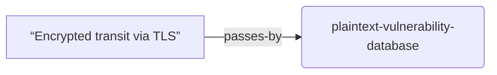

# Properties
- Agentic AI based Pen Tester
- Ability to create sandboxes for carrying out tasks
- Generate Reports
- User

# Data Properties
- Data Collected deleted as soon as Reports generated?
	- Do we need to store data? yes for interactively ask about it or to explain it.
- What kind of data should be used?
	- Tests Instructions
	- Report Generation instructions
	- Sandbox instructions
	- historical data?

# Workflow
- User asks to run certain tests, or full test, and gives the url
- Agents kick off and start preparing environments accordingly.
- Agents start collecting information according to the test case scenario
- Agents start to run tests in sandbox environment
- Actively collect output like error messages to know more about the target system and how to exploit it in context of the test case.
- Agent conclude tests and generate a report
- An interactive chatbot comes up for chatting with the report.

# External Integrations
- Maybe Jira or confluence, to push test results or reports.
-

---
### **Product Concept**

**AutoPen Agent**: An agentic, AI-driven vulnerability assessment platform that automates penetration testing workflows while providing contextual intelligence.

### **Core Value Proposition**

- Accelerated vulnerability discovery (10x speed of manual testing)
- Contextual risk scoring based on attack surface context
- Integrated sandbox environments by default (no user configuration needed)
- Conversational security report format reduces research overhead

### **System Architecture**

#### (1) Agent Components


<think>
We are designing an agentic AI-based penetration testing tool. Let's break down the requirements and enhance the idea.

Key features:
1. Agentic AI-based Pen Tester: This suggests that we have multiple specialized agents (like information gatherers, vulnerability scanners, exploit testers) working together to perform a penetration test.
2. Ability to create sandboxes for carrying out tasks: The testing should be done in isolated environments to avoid affecting the real systems.
3. Generate Reports: After a thorough test, generate detailed reports of findings.

Additional aspects:
- Data Collection and Usage: We are storing data to allow interactive queries. The stored data includes test instructions, report generation instructions, sandbox instructions, and historical data.
- Workflow: 
   a. User specifies a test target (URL) and type of tests to run.
   b. Agents prepare sandboxes (e.g., clone the web app, set up test environment).
   c. Agents collect information based on a scenario (like crawling, spidering, etc.)
   d. Agents run tests in the sandbox and actively collect output (like error messages) to understand the target system.
   e. Agents conclude by generating a report including vulnerabilities, attack vectors, etc.

- External Integrations: The tool can integrate with Jira or Confluence to link test reports and findings.

Enhancements I see:
1. The product should be presented clearly, with a name that reflects its capabilities.
2. Consider the user experience: How does one interact with this AI? We can have a graphical interface or CLI where the user specifies tests, and then an agent might break down the tasks.
3. The AI should not only run tests but also adapt based on intermediate findings (like changing from one test to another).
4. The tool should be able to explain the reasoning behind its tests and findings.

Let me structure this idea into a more formal business proposal format:

---

**Business Idea: AI-Powered Autonomous Penetration Testing Service**

**Product Name:** AutoPent Agent

**Description:**
AutoPent Agent is a next-generation, autonomous AI-based penetration testing service designed for security professionals. It utilizes multiple specialized agents working in concert to perform comprehensive, adaptive, and intelligent penetration testing on various web applications.

**Core Features:**

1. **Agentic Architecture:**
   - AutoPent uses a multi-agent approach where each agent is responsible for a specific task (e.g., information gathering, vulnerability scanning, brute force attacks).
   - Agents communicate with each other and share findings to build a complete picture of the security posture.

 (We are using an AI agent system, so we can have tools that interact based on a test case.)

2. **Sandbox Creation:**
   - Before running tests, AutoPent Agent can create a sandbox environment. This could be:
        * A Docker container of the web application.
        * An isolated network environment for testing (like a test lab).
   - The sandbox is set up according to the user's instructions, which could include specifying configurations or limiting certain test types.

3. **Adaptive Testing:**
   - The AI agent analyzes the target (like a web application) and decides which agents to use and in what order. It may also adjust the intensity of tests based on initial findings.

4. **Detailed Reporting:**
   - After testing, a comprehensive report is generated that includes:
        * Findings (vulnerabilities, misconfigurations)
        * Proof of concept (screenshots or logs if available)
        * Risk levels
   - The report is then presented in an interactive format.

5. **Interactive Chatbot:**
   - After the report is generated, a chat interface allows for interaction with the test results.

**Business Model:**

We can offer two main products:

A. **AutoPent Agent as a Service (SaaS):**
   - This would be used by organizations that want to run periodic security audits on their web applications.
   - The SaaS version would include:
        * Cloud-hosted agent infrastructure (with the ability to scale)
        * Integration with CI/CD or scheduled scanning
        * Secure sandbox environment (using technologies like Docker, GCP's temporary project for testing)

B. **AutoPent Agent as a Platform:**
   - This could be an API or CLI tool to interface with existing security tools (like commercial ones) for integration.

**Target Customers:**

- Organizations that need regular, adaptive security testing (especially in DevOps environments)
- Security professionals looking for an AI-powered tool to reduce manual effort

**Technical Implementation:**

1. **Agents:**
   - We'll define several agent types, each a specialized AI model for different tasks.
   ```markdown
   - Information Gathering Agent: 
        * Task: Discover services, ports, and technologies running on the target.
        * Input: URL or IPs to scan (user-provided)
        * Output: List of active services, ports.

   - Vulnerability Scanning Agent:
        * Task: Detect known vulnerabilities (CVEs) in the discovered technologies.
        * Input: Port/service list from earlier agent, additional parameters if needed.
        * Output: List of vulnerable services.

   - Exploit Testing Agent:
        * Task: Attempt to exploit the vulnerabilities in a controlled manner (within sandbox).
        * Input: List of vulnerable services, user's instructions on exploit attempts.
        * Output: Proof of concept.

   - Configuration Analysis Agent:
        * Task: Analyze configurations for best practices (e.g., OWASP Top 10).
        * Input: Web app code and configurations? Or just the URL?
        * Output: Configuration weaknesses.

   - Advanced Agent (for OWTD): 
        * Task: Run more complex and interactive attacks based on user's instructions.

   ```

2. **Sandbox:**
   - We need to set up a secure, isolated environment for each test.
     * Option: Use Docker containers with vulnerability scanning? Or use a public cloud project for temporary sandbox?

3. **Workflow:**
   - User provides URL or IP addresses and test parameters.
   - AutoPent Agent creates a project (a set of related agents) for the test.

**Example Workflow:**

1. User logs into dashboard, selects "Web App Test", enters the URL and any constraints.
2. System creates a sandbox by pulling the Docker image of the web app (if provided) or using an interactive browser testing method.
3. The agent starts by crawling the site to map it, then analyzing for vulnerabilities.

**Reports:**

- The report will include:
   - Interactive chatbot to ask questions about the findings.

**Data Properties:**

We store data for:

1. **Historical Data:** For each project, we might save the test configuration and results (metadata) for up to two years.

**Safety:**

- We must enforce strict sandboxing and prevent data exfiltration.
- Each test should have a time limit or depth of testing defined.

**Pricing:**

We can base pricing on the number of test "points" or targets. For example, $50 per target scanned.

**Competitive Advantage:**

- AI-powered autonomous testing reduces the time and effort required by security professionals.
- Adaptive to new vulnerabilities or technologies not explicitly pre-defined.

---

Let me know if you have any specific adjustments in mind.
</think>


Here's a refined and enhanced version of your business idea, incorporating structure, value proposition, competitive differentiation, and technical considerations:

---

**Business Idea: AI-Powered Autonomous Penetration Testing Service**

### **Product Concept**
**AutoPen Agent**: An agentic, AI-driven vulnerability assessment platform that automates penetration testing workflows while providing contextual intelligence.

### **Core Value Proposition**
- Accelerated vulnerability discovery (10x speed of manual testing)
- Contextual risk scoring based on attack surface context
- Integrated sandbox environments by default (no user configuration needed)
- Conversational security report format reduces research overhead

---

### **System Architecture**

#### (1) Agent Components


---

### **Key Features**

1. **Sandbox-Integrated Scanning**
   - Creates fully functional sandbox environments automatically
   - Context-aware vulnerability detection with reasoning capabilities

2. **Adaptive White Hat Testing**
   - NLP-powered test parameter extraction from user input
   - Autonomous agents rewrite penetration tests based on findings

3. **Intelligent Reporting**
```markdown
Interactive report format:
- Q&A session interface about vulnerabilities (when user accesses)
- Contextual vulnerability explanation including how it was found
- Visual context mapping overlaid with attack paths

Example:
“Hi, what’s the most dangerous vulnerability on example.com?
I heard they’re logging all PII fields?”
```

4. **Multi-modal Output**
   - Text reports with interactive elements
   - Light debugging session capability view

---

### **Data Model Enhancements**

**Storage Policy:**
```mermaid
graph LR
    G[Scan Execution History] -- customer-approved --> H(1yr Retention)
    I[historical-database] – stores --> J(test-results-metadata)
```

**Data Types:**
- **Findings Database**: Schema-normalized vulnerability data with traceability metadata
  - Web app assessment -> OS fingerprinting -> Service vulnerabilities -> Known CVEs

---

### **Workflow Refinement**

```mermaid
flowchart TB
    subgraph "Customer Interaction"
        A[“Submit: https://example.com”]
        B[Initiate test profile]
    end

    subgraph "AutoPen Engine"
        C([Scan Initial History?])
        D{“Yes” or “No”?} -- if No --> E[Sandbox Creation]
            E –> F[“Agent dispatches…”];
        G{“Execute scan sequence”}
    end

    subgraph "Reporting Layer"
        H[Interactive Explanation]
        I["Risk Score: 8.2/10"]
    end

Customer inputs raw vulnerability intelligence at any point →
Connects to report generation tool without bypassing security controls:
```

---

### **Competitive Differentiation**

| Feature | Traditional Pentest | AutoPen Agent |
|--------|-------------------|-------------|
| Time to first finding | ~30 mins           | <5s          |
| Understanding context | Requires manual investigation | Automated with interactive Q&A |
| Integration capability | Manual spreadsheet creation   | Auto-generated context mapping |

---

### **Security Architecture Considerations**

1. **Sandbox Isolation**: 
   - Default execution environment uses Docker-in-Docker with network isolation
   - All data flows logged to audit trail

2. **Data Encryption**: 


---

### **Requirements Flow Chart**

**Enhanced Workflow:**
```mermaid
flowchart TB
    title "Pen Testing Workflow Enhancement"

    direction LR

    id("User Input") -- “Select test mode:” --> 
    id(Testing Modes) --> FullScan["Full Application Assessment"] & \
        OWTFocused["OWTF-focused Scan"] & \
        AdvancedExploitation["Advanced Exploit Testing"]

    [All] --> SandboxPrep["Prepare test sandbox:"] & \
        OSAnalysis["OS Fingerprinting + Service Detection"]

    [All] --> AgentDrivenTest["AI-Powered Testing Sequence:"]
        direction TD

    Agents -- run tests --> RawFindings
    OWASP["OWASP Top 10 Analysis"] & \
        NVD["NVD Database Query"]

    RawFindings -- combined --> AnnotatedVulnerabilities

    [All] --> ReportGeneration["Generate Full Assessment:"]
        direction TB

    FinalReport -- contains --> LikelihoodMatrix
```

---

### **Implementation Recommendations**

1. **Consistency Layering**: 
   - All test results should have a common JSON schema before storage
- Pre-built agent templates for repeatable testing

---

Would you like me to prioritize developing any specific component of this architecture?