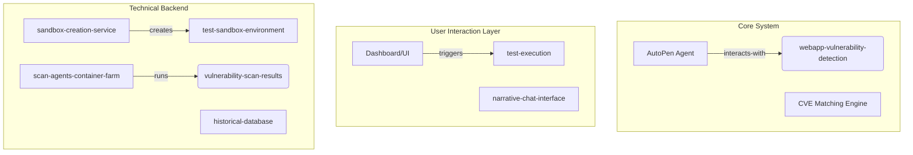
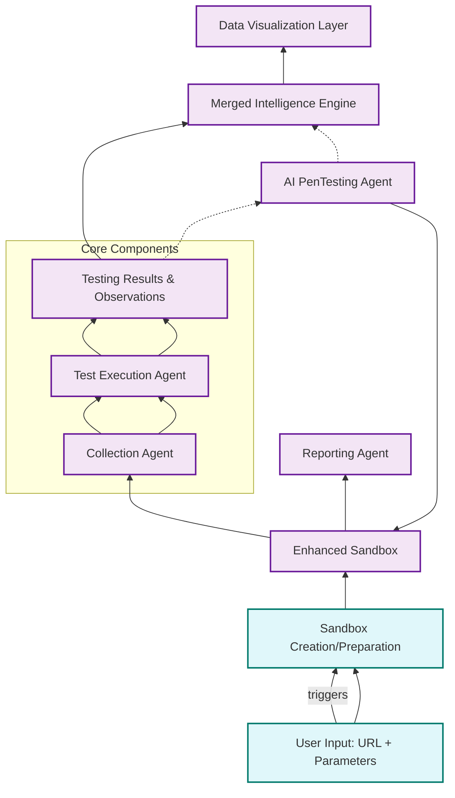
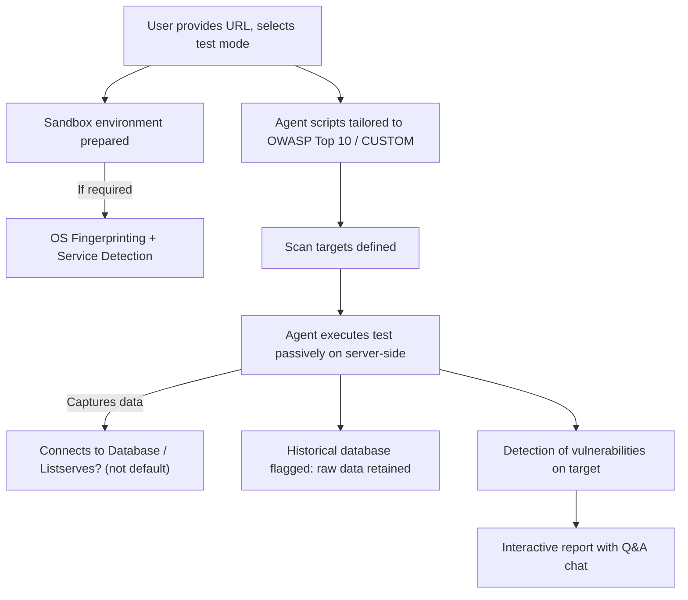
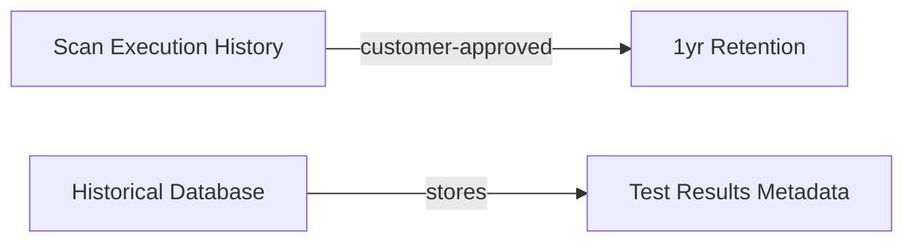
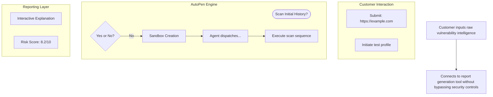
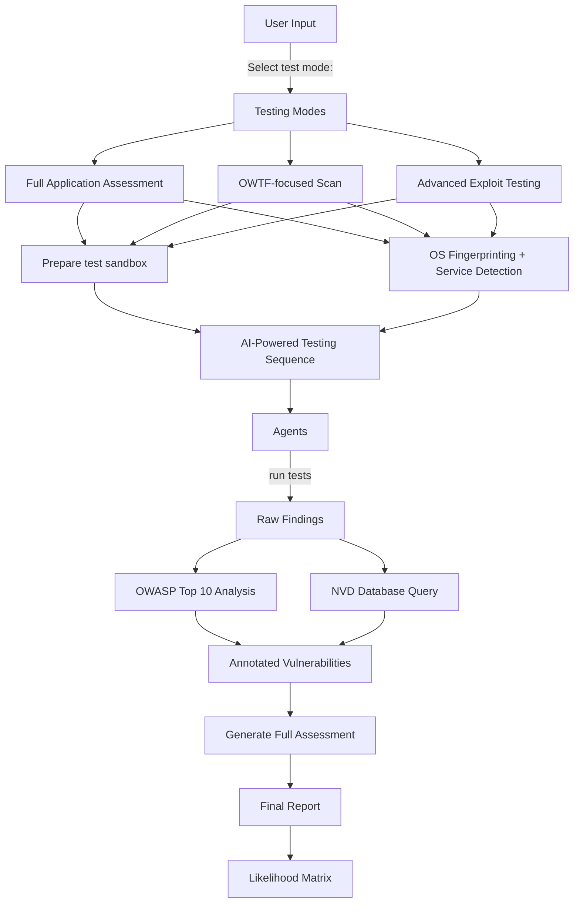

### **System Architecture**

#### (1) Agent Components






---
### **Key Features**

1. **Sandbox-Integrated Scanning**
    - Creates fully functional sandbox environments automatically
    - Context-aware vulnerability detection with reasoning capabilities
2. **Adaptive White Hat Testing**
    - NLP-powered test parameter extraction from user input
    - Autonomous agents rewrite penetration tests based on findings
3. **Intelligent Reporting**
	- Interactive report format: 
		- Q&A session interface about vulnerabilities (when user accesses) 
		- Contextual vulnerability explanation including how it was found 
		- Visual context mapping overlaid with attack paths 
			- Example: “Hi, what’s the most dangerous vulnerability on example.com? I heard they’re logging all PII fields?”
4. **Multi-modal Output**
    - Text reports with interactive elements
    - Light debugging session capability view

---

### **Data Model Enhancements**

**Storage Policy:**



**Data Types:**

- **Findings Database**: Schema-normalized vulnerability data with traceability metadata
    - Web app assessment -> OS fingerprinting -> Service vulnerabilities -> Known CVEs

---
### **Workflow Refinement**



---
### **Competitive Differentiation**

|Feature|Traditional Pentest|AutoPen Agent|
|---|---|---|
|Time to first finding|~30 mins|<5s|
|Understanding context|Requires manual investigation|Automated with interactive Q&A|
|Integration capability|Manual spreadsheet creation|Auto-generated context mapping|

---

### **Security Architecture Considerations**

1. **Sandbox Isolation**:
    
    - Default execution environment uses Docker-in-Docker with network isolation
    - All data flows logged to audit trail
2. **Data Encryption**:
	```mermaid
	graph LR
    G[“Encrypted transit via TLS”] -- passes-by --> H(plaintext-vulnerability-database)

	```
---

### **Requirements Flow Chart**

**Enhanced Workflow:**



